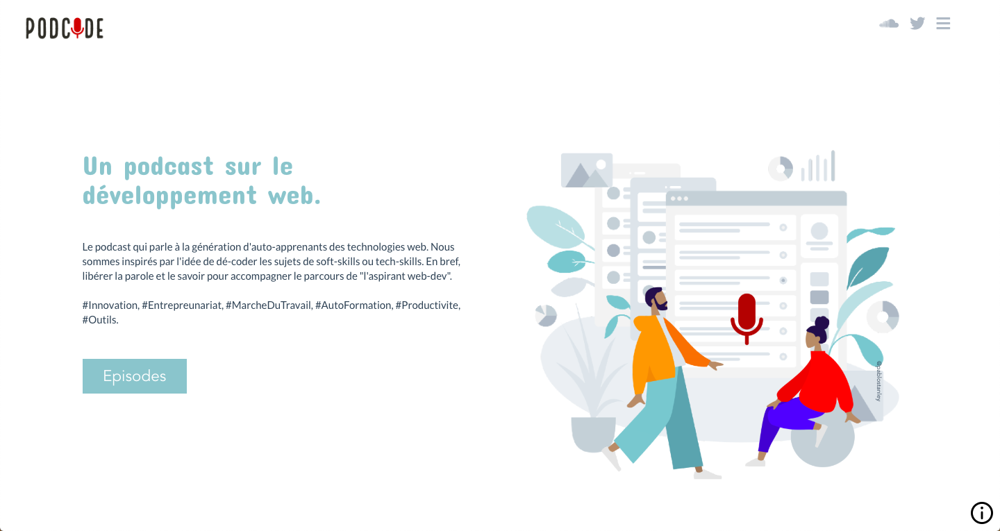
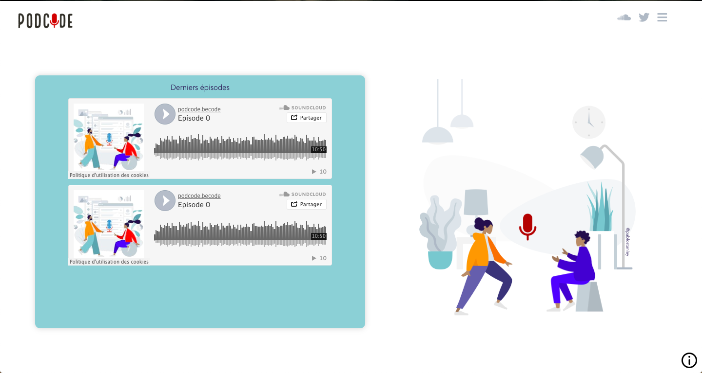

# indiemakerfr-landing-page

indiemakerfr is a project of some of becode-lovelace students. The aim is to allow new web developers to have access to information about their training / future job, in French. This informations will be available as podcasts, so we needed a site for hosting them which reflects the state of mind in which this project was born.

*Tags: podcast, web, development, community*

## Getting Started

The project’s is realized in Vue.Js and consists of 2 pages, dynamically loaded with a router: a home page and a page to access the different podcasts.

## Visual

## Built With
- Vue.js  
- Visual Code Studio

- The build and deployement is not done yet

## Versioning
We use Github Projects for versioning. For the versions available, see the tags on this repository.

---

## Team

THe development team is: 

| Andrés Goldestein | Emilie Bialais | 
| :---: |:---:|
| | | 
| <a href="https://github.com/riderx" target="_blank">`github.com/riderx`</a> | <a href="https://github.com/Ebialais" target="_blank">`github.com/Ebialais`</a> |

---

## Acknowledgments

Team Becode
